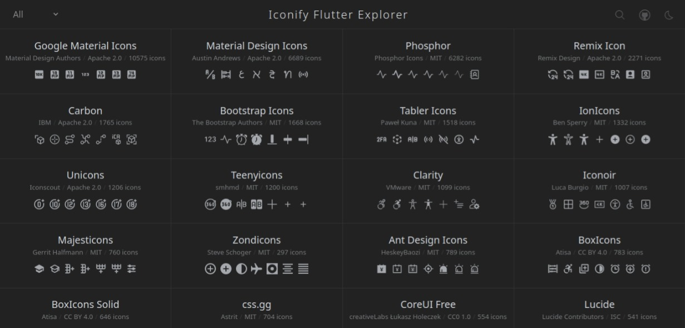

<h1 align="center">
Iconify Flutter Explorer
</h1>

Icon Explorer with <b>Instant</b> searching<a href="https://pub.dev/packages/iconify_flutter" target="_blank">Iconify Flutter</a> 

<a href="https://icones.js.org">Ported from Icones by @antfu</a>

## License

MIT - Anthony Fu 2020
